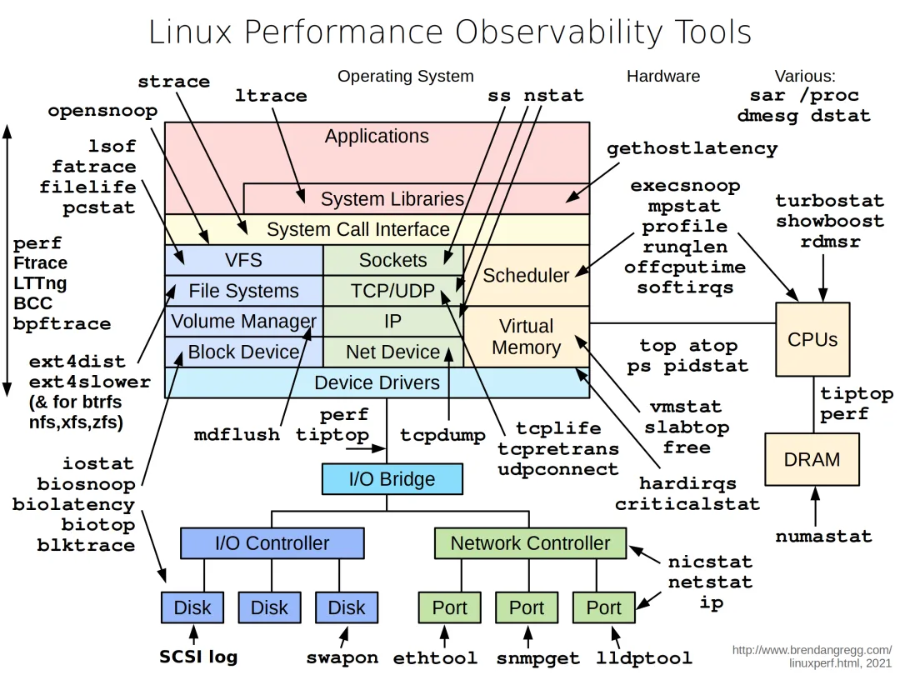
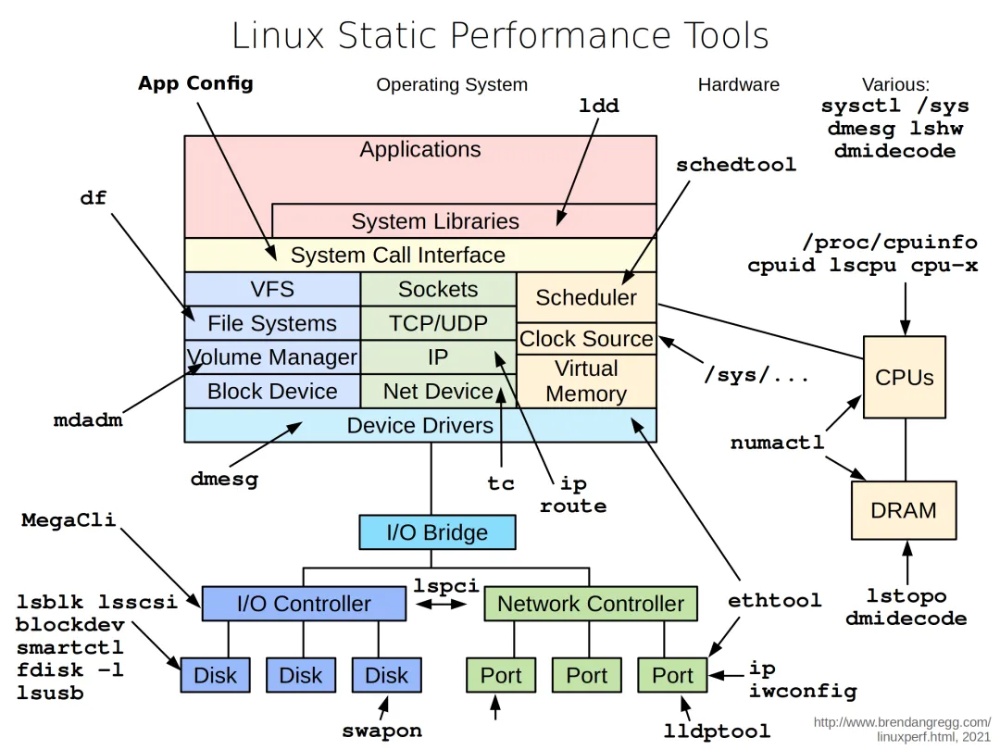
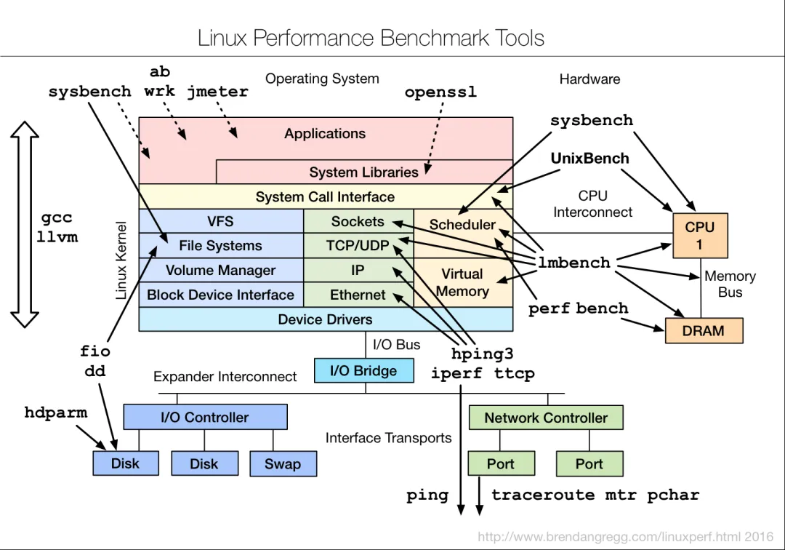
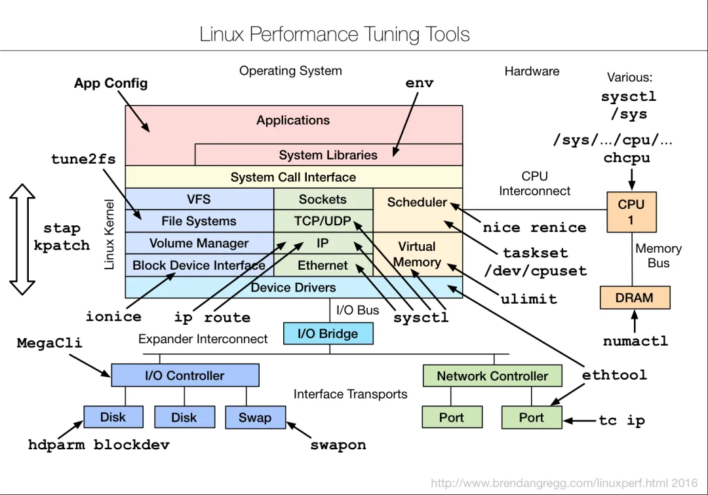
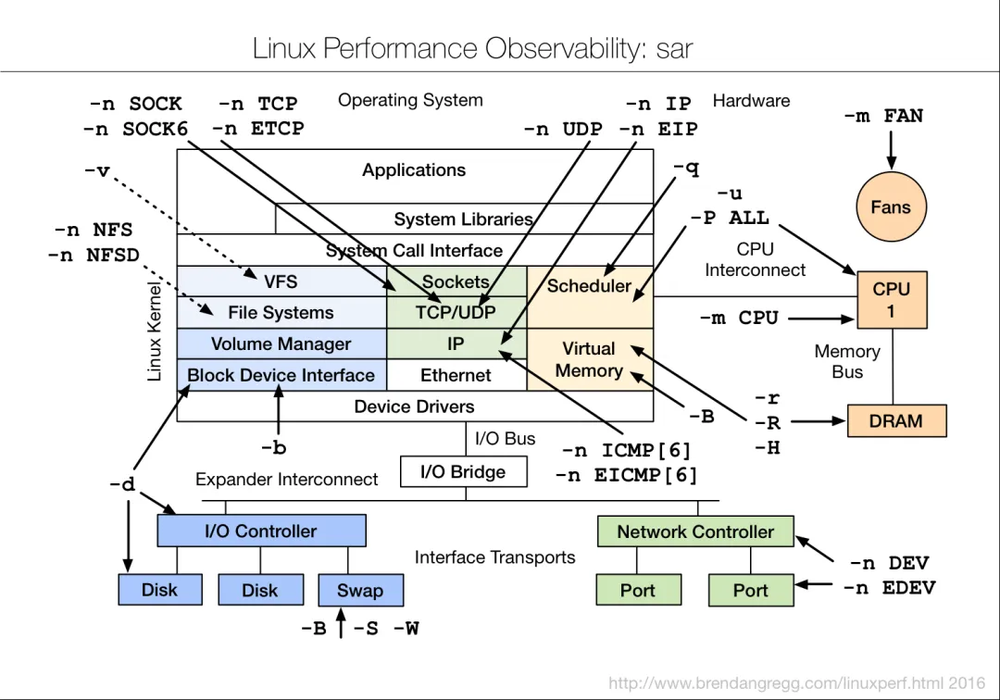
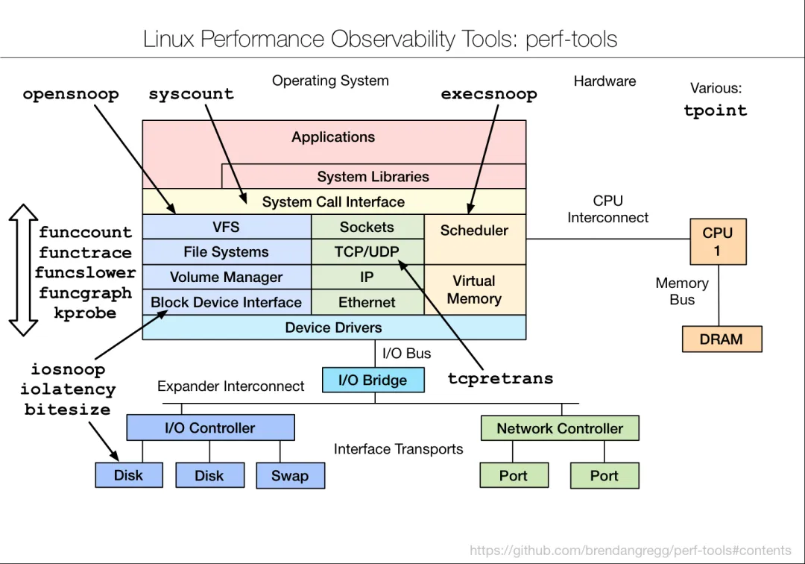
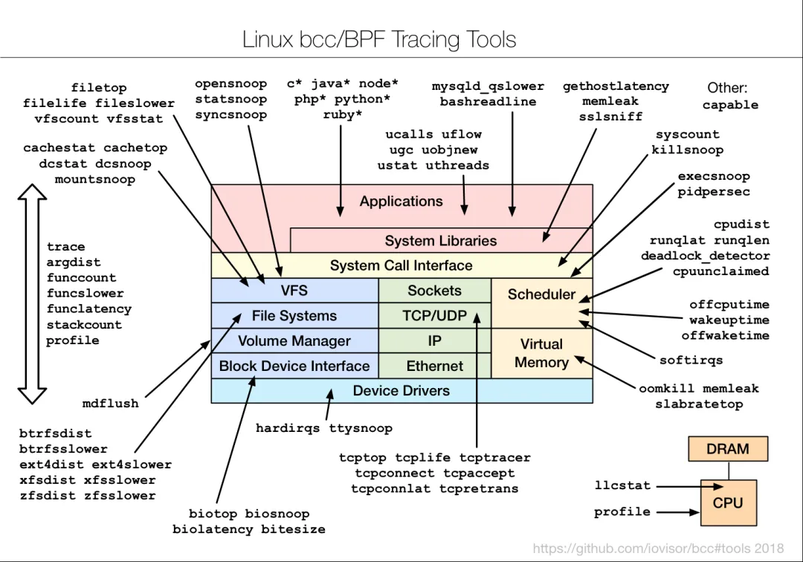
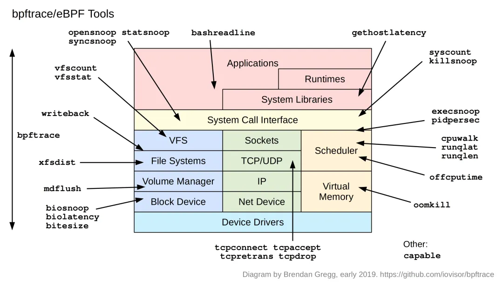
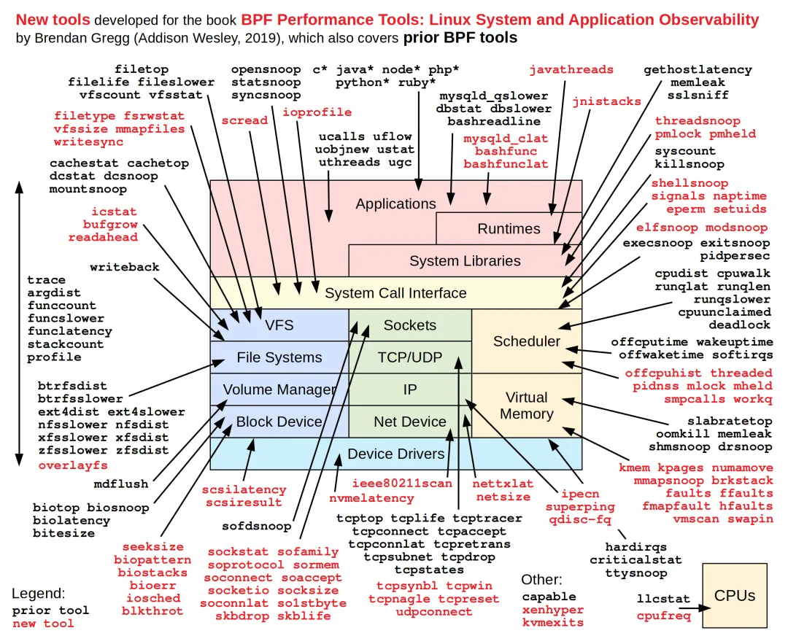

# Linux_analysis_tools

## 性能观察工具：

## 静态性能工具

## 性能压测工具：

## 性能调优工具:

## sar:

## perf-tools:

## 追踪工具:

 

## BPF 性能工具：

---

> 作者: Leon  
> URL: https://blog.20190313.xyz/posts/linux_analysis_tools/  

